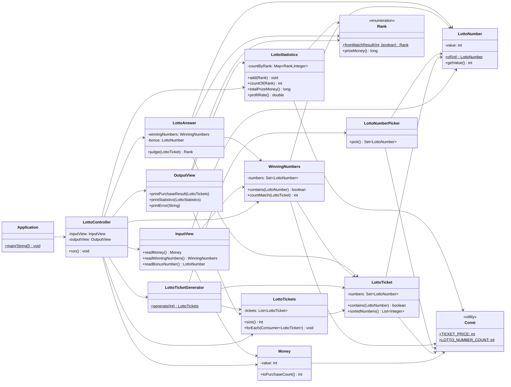

# 로또 자동 구매 기능 명세 (요청 클래스 구조 기준)

## 1. 목표
- 요청한 클래스 구조를 기준으로 로또 자동 구매의 최소 기능을 정의한다.

## 2. 기능 요구사항
### 2.1 입력
- `InputView`에서 구입 금액을 입력받는다.
- `InputView`에서 지난 주 당첨 번호 6개와 보너스 번호 1개를 입력받는다.

### 2.2 자동 발급
- 로또 1장의 가격은 1000원이다.
- `Money`로 구매 가능 수량을 계산한다.
- `LottoTicketGenerator`가 티켓 수량만큼 `LottoTicket`을 생성한다.
- 구입 금액(`Money`)과 발급된 `List<LottoTicket>`은 실행 흐름 객체가 직접 관리한다.
- `OuputView`가 구매 수량과 티켓 번호를 출력한다.

### 2.3 당첨 판정
- `LottoAnswer`는 당첨 번호 6개와 보너스 번호 1개를 가진다.
- `LottoAnswer.judge(LottoTicket)`로 티켓 1장의 결과를 `Rank`로 판정한다.
- `Rank`는 당첨 기준과 상금 정보를 가진 enum으로 관리한다.

### 2.4 통계/수익률
- `LottoStatistics`는 `Map<Rank, Integer>`로 등수별 당첨 개수를 집계한다.
- 총 당첨금과 수익률(총 당첨금 / 구입 금액)을 계산한다.
- `OuputView`가 당첨 통계와 수익률을 출력한다.

## 3. 검증 규칙
- 구입 금액은 1000원 이상, 1000원 단위여야 한다.
- `LottoNumber`는 1~45 범위여야 한다.
- `LottoTicket`은 중복 없는 6개 번호여야 한다.
- `LottoAnswer`의 기본 당첨 번호는 중복 없는 6개여야 한다.
- 보너스 번호는 기본 당첨 번호와 중복되면 안 된다.
- 검증 실패 시 `[ERROR]` 메시지를 출력하고 재입력한다.

## 4. 처리 흐름
1. `InputView`에서 구입 금액 입력
2. 실행 흐름 객체에서 `Money`를 보관
3. `LottoTicketGenerator`로 `List<LottoTicket>` 생성 및 보관
4. `OuputView`로 발급 티켓 출력
5. `InputView`에서 당첨 번호/보너스 입력 후 `LottoAnswer` 생성
6. 모든 `LottoTicket`을 `LottoAnswer.judge()`로 판정
7. `LottoStatistics`에 `Rank` 집계
8. `OuputView`로 통계/수익률 출력

## 5. 클래스 책임
- `InputView`: 콘솔 입력 처리
- `OuputView`: 콘솔 출력 처리
- `LottoController`: 실행 흐름 제어, `Money`와 `List<LottoTicket>` 관리
- `Money`: 구입 금액 값 객체 및 구매 수량 계산
- `LottoNumber`: 번호 값 객체(범위 검증)
- `LottoTicket`: 로또 한 장(`Set<LottoNumber>`)과 티켓 유효성 보장
- `LottoTicketGenerator`: 자동 번호 생성
- `LottoAnswer`: 당첨 번호/보너스 보관, `judge()` 제공
- `Rank`: 당첨 등수 enum
- `LottoStatistics`: 등수별 개수, 총 당첨금, 수익률 계산

## 6. 구현 원칙 (과제 요구 반영)
- `else` 없이 조기 반환으로 분기 단순화
- 메서드 길이 10라인 이내 지향
- 메서드 단일 책임 유지
- 배열 대신 `ArrayList` 사용
- 원시값/문자열 포장
- 일급 컬렉션(`Set<LottoNumber>`, `LottoStatistics`) 사용
- enum(`Rank`) 사용

## 7. 클래스 다이어그램

# 로또
## 진행 방법
* 로또 요구사항을 파악한다.
* 요구사항에 대한 구현을 완료한 후 자신의 github 아이디에 해당하는 브랜치에 Pull Request(이하 PR)를 통해 코드 리뷰 요청을 한다.
* 코드 리뷰 피드백에 대한 개선 작업을 하고 다시 PUSH한다.
* 모든 피드백을 완료하면 다음 단계를 도전하고 앞의 과정을 반복한다.

## 온라인 코드 리뷰 과정
* [텍스트와 이미지로 살펴보는 온라인 코드 리뷰 과정](https://github.com/next-step/nextstep-docs/tree/master/codereview)
