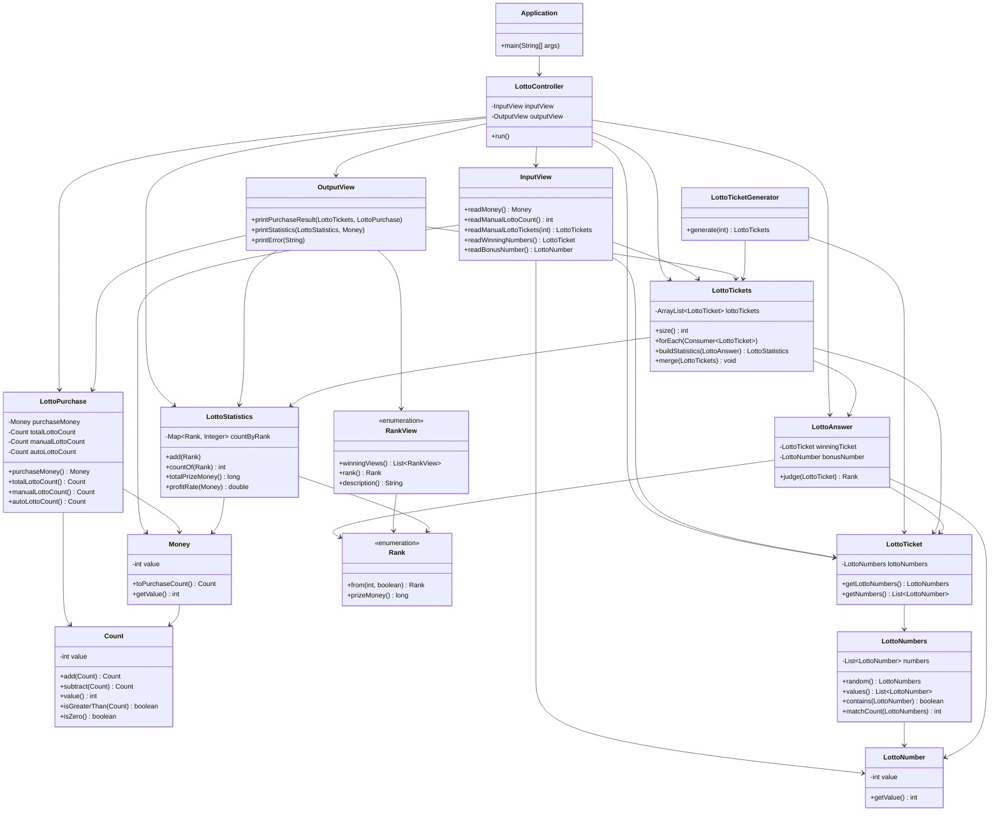

# Lotto

## 클래스별 설명

- `Application`: 프로그램 진입점이다. `LottoController`를 생성하고 실행한다.
- `LottoController`: 전체 흐름을 조율한다. 구입 금액/수동 수량 입력, 수동·자동 티켓 생성, 당첨 판정, 통계 출력을 수행한다.
- `InputView`: 콘솔 입력을 담당한다. 구입 금액, 수동 구매 수량, 수동 번호들, 당첨 번호, 보너스 번호를 읽어 도메인 객체로 변환한다.
- `OutputView`: 콘솔 출력을 담당한다. 수동/자동 구매 결과, 발급 티켓 목록, 당첨 통계, 수익률, 에러 메시지를 출력한다.
- `Money`: 구입 금액 VO다. 1000원 이상/1000원 단위 검증과 구매 가능 수량 계산(`Count`)을 담당한다.
- `Count`: 개수 VO다. 0 이상 검증, 덧셈/뺄셈, 비교/0 여부 확인을 담당한다.
- `LottoPurchase`: 구매 모델이다. `Money`와 수동 구매 수량(`Count`)을 받아 총 구매 수량/자동 수량을 계산하고 수동 수량 초과를 검증한다.
- `LottoNumber`: 로또 번호 VO다. 1~45 범위 검증과 동등성 비교를 제공한다.
- `LottoNumbers`: 번호 6개를 감싸는 일급 컬렉션이다. 개수/중복 검증, 정렬, 랜덤 생성, 포함 여부 및 일치 개수 계산을 담당한다.
- `LottoTicket`: 로또 한 장을 표현한다. 내부적으로 `LottoNumbers`를 보유한다.
- `LottoTicketGenerator`: 자동 번호 티켓을 생성해 `LottoTickets`로 반환한다.
- `LottoTickets`: 여러 장의 티켓을 감싸는 일급 컬렉션이다. 순회, 통계 집계, 컬렉션 병합을 담당한다.
- `LottoAnswer`: 당첨 티켓과 보너스 번호를 보관한다. 티켓 1장의 등수를 판정한다.
- `Rank`: 당첨 등수 enum이다. 일치 개수와 보너스 여부로 등수를 계산하고 상금을 제공한다.
- `RankView`: 출력 전용 enum이다. `Rank`와 화면 표시 문구를 매핑한다.
- `LottoStatistics`: 등수별 당첨 개수를 집계한다. 총 당첨금과 수익률을 계산한다.

## Class Diagram

